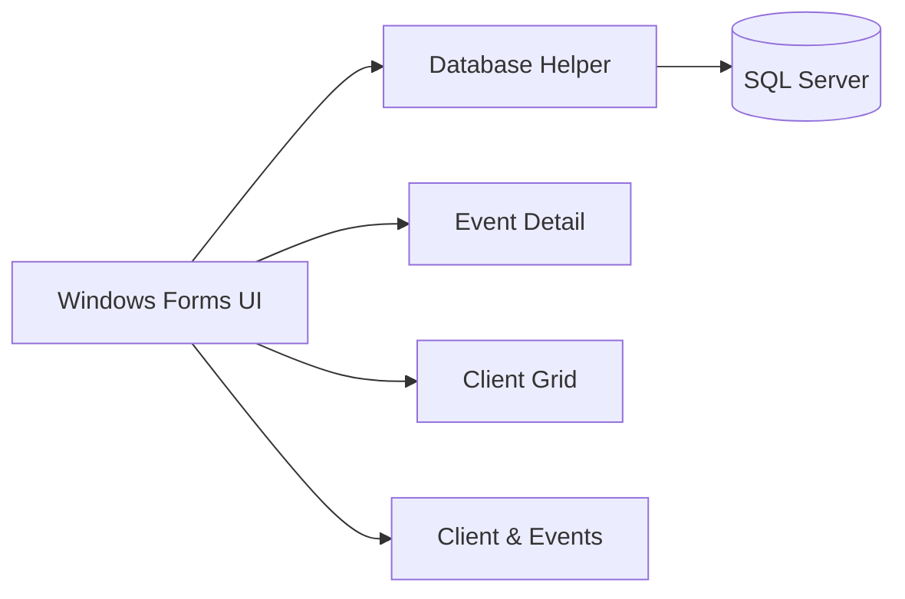

# Summit Signature Events Database Application

A Windows desktop application for managing event-planning operations, built with **C# Windows Forms**, **SQL Server**, and **ADO.NET**.

The application connects a normalized relational database to three user-facing workflows: individual event maintenance, bulk client maintenance, and a master-detail client/event view.

## Highlights

- SQL Server relational database with primary keys, foreign keys, constraints, test data, a view, a user-defined function, and a stored procedure
- C# Windows Forms desktop interface
- Parameterized SQL commands for database updates
- CRUD workflows for event and client records
- Master-detail relationship between clients and their related events
- Data validation before database writes
- Reusable database helper for connection and query execution
- Simple application menu for navigating between workflows

## Application Features

### Event Detail
View one event at a time, move between records, create new events, and update:

- event name and date
- guest count and budget
- event status
- client
- venue
- event type
- lead planner

### Client Grid
View multiple clients in a `DataGridView`, add a new client, edit existing contact information, and persist changes back to SQL Server.

### Client & Events
A master-detail interface that displays one client with that client's related events. Users can update client information and edit related event records from the same workflow.

## Tech Stack

- **Language:** C#
- **UI:** Windows Forms
- **Framework:** .NET Framework 4.8
- **Database:** Microsoft SQL Server
- **Data access:** ADO.NET (`SqlConnection`, `SqlCommand`, `SqlDataAdapter`, `DataTable`)
- **IDE:** Visual Studio

## Architecture



The application uses a small shared `Db` helper class to centralize connections and common query execution while each form contains the SQL needed for its workflow.

## Database Design

The database models core event-planning entities including clients, venues, event types, employees, vendors, events, vendor assignments, and staff assignments.

The physical ERD is available here:

[`docs/Summit_Signature_Events_ERD.pdf`](docs/Summit_Signature_Events_ERD.pdf)

## Run Locally

### Requirements

- Windows 10/11
- Visual Studio with **.NET desktop development** installed
- SQL Server / SQL Server Express
- SQL Server Management Studio recommended

### 1. Create the database

Run:

```text
database/create_database.sql
```

in SQL Server Management Studio. The script creates the `SummitSignatureEventsPart1` database and loads sample data.

### 2. Open the application

Open:

```text
SummitSignatureEvents.sln
```

in Visual Studio.

### 3. Configure SQL Server if necessary

`Db.cs` checks several common local SQL Server instance names automatically. If your instance uses a different name, add it to `CandidateDataSources` in:

```text
src/SummitSignatureEvents/Db.cs
```

Example:

```csharp
private static readonly string[] CandidateDataSources =
{
    @"YOUR-PC\SQLEXPRESS",
    @".\SQLEXPRESS",
    @".",
    @"(local)",
    @"localhost",
    @"(localdb)\MSSQLLocalDB"
};
```

### 4. Build and run

In Visual Studio:

1. **Build > Build Solution**
2. Press **F5**
3. Use the main menu to open each workflow

## Repository Structure

```text
SummitSignatureEvents/
├── README.md
├── SummitSignatureEvents.sln
├── database/
│   └── create_database.sql
├── docs/
│   ├── Summit_Signature_Events_ERD.pdf
│   └── screenshots/
└── src/
    └── SummitSignatureEvents/
        ├── Db.cs
        ├── Program.cs
        ├── frmMainMenu.cs
        ├── frmEventDetail.cs
        ├── frmClientGrid.cs
        └── frmClientEventsMain.cs
```


## What This Project Demonstrates

This project demonstrates my ability to translate a relational database design into a working desktop application, connect a C# interface to SQL Server, implement CRUD operations, work with parent-child relationships, validate user input, and organize database-backed workflows around realistic business use cases.
